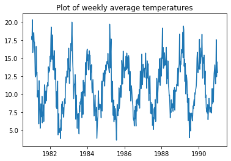
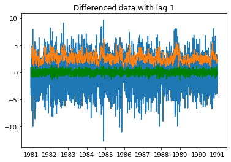
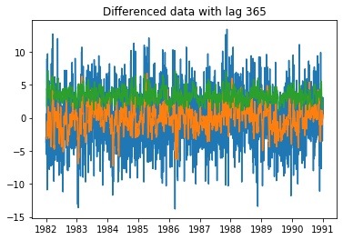
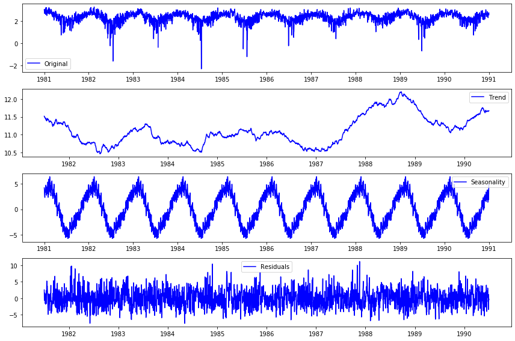
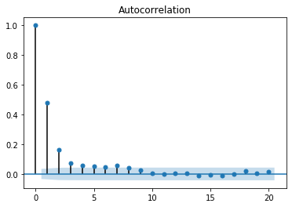
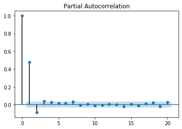

# Time Series Review

## What is the first thing we do with a time series dataset? 
Change the Date to datetime and assign it as an index


```python

ts['Date'] = pd.to_datetime(ts['Date'])
ts.set_index('Date', inplace=True)
```


```python

# What is the frequency of the time series
print(ts.index)
print('Daily sample from 1981 through 1990')
```

    DatetimeIndex(['1981-01-01', '1981-01-02', '1981-01-03', '1981-01-04',
                   '1981-01-05', '1981-01-06', '1981-01-07', '1981-01-08',
                   '1981-01-09', '1981-01-10',
                   ...
                   '1990-12-22', '1990-12-23', '1990-12-24', '1990-12-25',
                   '1990-12-26', '1990-12-27', '1990-12-28', '1990-12-29',
                   '1990-12-30', '1990-12-31'],
                  dtype='datetime64[ns]', name='Date', length=3650, freq=None)
    Daily sample from 1981 through 1990


```python

# Plot the series
import matplotlib.pyplot as plt

plt.plot(ts)
plt.title('Daily Temperature in Melbourne')
```


    Text(0.5, 1.0, 'Daily Temperature in Melbourne')


What types of patterns do you see in this data?
- Trend?
- Seasonality?
- Change in variance?
- Cyclical?


```python

'''
What types of patterns do you see in this data?
- Trend - doesn't seem to be
- Seasonality- definitely seems to have yearly seasonality
- Change in variance - Variance looks constant
- Cyclical - does not look cyclical
'''
```


    "\nWhat types of patterns do you see in this data?\n- Trend - doesn't seem to be\n- Seasonality- definitely seems to have yearly seasonality\n- Change in variance - Variance looks constant\n- Cyclical - does not look cyclical\n"


## Visual Tests for Stationarity

The basic time series models (Autoregressive, Moving Average, ARMA) expect the input time series to be stationary.  We can do some visual checks for stationarity by plotting the rolling mean and std.


```python

# Save the rolling mean and std to the variables defined below

# 10 is the window size, which can be larger or smaller depending on the size of your dataset.
rolling_mean = ts.rolling(10).mean()
rolling_std = ts.rolling(10).std()
```


```python

# Plot the rolling mean and std along with the original time series

plt.plot(ts)
plt.plot(rolling_mean)
plt.plot(rolling_std)
```


    [<matplotlib.lines.Line2D at 0x1c3b6c0b70>]


## Manipulating time series
There are many ways we can manipulate our time series, including resampling and differencing.

## Downsample the data so that it is weekly then plot


```python

# Downsample the data so that it is weekly then plot

ts_weekly = ts.resample('W').mean()

plt.plot(ts_weekly)
plt.title('Plot of weekly average temperatures')

```


    Text(0.5, 1.0, 'Plot of weekly average temperatures')





## Difference the data with different lags. Plot the lagged value along with the rolling mean and std


```python
# Difference the data with different lags. Plot the lagged value along with the rolling mean and std

plt.plot(ts.diff(1))
plt.plot(ts.diff(1).rolling(10).mean(), 'green')
plt.plot(ts.diff(1).rolling(10).std())
plt.title('Differenced data with lag 1')
```


    Text(0.5, 1.0, 'Differenced data with lag 1')





```python
# Difference the data with different lags. Plot the lagged value along with the rolling mean and std

plt.plot(ts.diff(365))
plt.plot(ts.diff(365).rolling(10).mean())
plt.plot(ts.diff(365).rolling(10).std())
plt.title('Differenced data with lag 365')
```


    Text(0.5, 1.0, 'Differenced data with lag 365')





```python

# Run a Dickey Fuller test on the original series and interpret the result.
# Does the Dickey Fuller test make sense with your intuition?
from statsmodels.tsa.stattools import adfuller

dftest = adfuller(ts['Temp'])

# Extract and display test results in a user friendly manner
dfoutput = pd.Series(dftest[0:4], index=['Test Statistic', 'p-value', '#Lags Used', 'Number of Observations Used'])
for key,value in dftest[4].items():
    dfoutput['Critical Value (%s)'%key] = value
print(dftest)

# No, it doesn't really.  The Dickey Fuller Test says sationary, but there is seasonal stationarity.
# DF does not take into account seasonal fluctuations.
```

    (-4.444804924611681, 0.00024708263003611787, 20, 3629, {'1%': -3.4321532327220154, '5%': -2.862336767636517, '10%': -2.56719413172842}, 16642.822304301197)


```python

# Plot decompostion

# Import and apply seasonal_decompose()
from statsmodels.tsa.seasonal import seasonal_decompose
decomposition = seasonal_decompose(ts, freq=365)

# Gather the trend, seasonality, and residuals 
trend = decomposition.trend
seasonal = decomposition.seasonal
residual = decomposition.resid

# Plot gathered statistics
plt.figure(figsize=(12,8))
plt.subplot(411)
plt.plot(np.log(ts), label='Original', color='blue')
plt.legend(loc='best')
plt.subplot(412)
plt.plot(trend, label='Trend', color='blue')
plt.legend(loc='best')
plt.subplot(413)
plt.plot(seasonal,label='Seasonality', color='blue')
plt.legend(loc='best')
plt.subplot(414)
plt.plot(residual, label='Residuals', color='blue')
plt.legend(loc='best')
plt.tight_layout()
```

    /Users/johnmaxbarry/.local/lib/python3.7/site-packages/ipykernel_launcher.py:17: RuntimeWarning: divide by zero encountered in log





##  Basic Time Series Models

## Autoregressive Model
$$\large Y_t = \mu + \phi * Y_{t-1}+\epsilon_t$$

- 1st order: Predict today's value based on yesterday's value

## Moving Average Model

$$\large Y_t = \mu +\epsilon_t + \theta * \epsilon_{t-1}$$

- 1st order: Predict today's value based on the weighted sum of today and yesterday's error


To determine the order, we look at partial autocorrelation and autocorrelation plots.

Use statsmodels to plot the pacf and acf of the residuals. We use residuals because the basic ARMA and MA models expect stationary series as inputs.

What do the plots suggest are the correct terms for MA and AR?


```python
from statsmodels.graphics.tsaplots import plot_pacf, plot_acf

plot_acf(residual.dropna(), lags=20)
plot_pacf(residual.dropna(), lags=20)
```








# NLP Review 

## What are the preprocessing steps 


```python
# What are the preprocessing steps 
'''
1. Remove punctuation/numbers
2. make lower case
3. Remove stopwords
4. STEM/Lemmatize
'''

```


    '\n1. Remove punctuation/numbers\n2. make lower case\n3. Remove stopwords\n4. STEM/Lemmatize\n'


## Let's perform manual removal with list comprehensions and such


```python

# Manual removal with list comprehension

emma_tokens = austen_docs[0].split(' ')
emma_tokens_no_n = []
for token in emma_tokens:
    if '\n' in token:
        no_n = token.split('\n')
        no_n = [word for word in no_n if word != '']
        [emma_tokens_no_n.append(word) for word in no_n]
    else:
        emma_tokens_no_n.append(token)
        
# Manual Removal of punct
import string
# emma_tokens_no_n = [word for word in emma_tokens_no_n if word not in string.punctuation]
emma_tokens_lower = [word.lower() for word in emma_tokens_no_n]
emma_no_punct = [word.translate(str.maketrans('', '', string.punctuation)) 
                 for word in emma_tokens_lower]


# Remove stopwords
from nltk.corpus import stopwords

stopwords = stopwords.words('english')
emma_no_stop = [word for word in emma_no_punct if word not in stopwords]

```

## We can also use sklearn's built in tools.
First code a Count Vectorizer, and change some of the parameters to do different things


```python

# We can also use sklearn's built in tools.
# First code a Count Vectorizer, and change some of the parameters to do different things

# Use cv/tfidf
from sklearn.feature_extraction.text import CountVectorizer, TfidfVectorizer

cv = CountVectorizer(token_pattern='[a-zA-Z][a-z]*', min_df =2, ngram_range=(1,2), stop_words=stopwords)

doc_term = pd.DataFrame(cv.fit_transform(austen_docs).toarray())
doc_term.columns = cv.vocabulary_
doc_term.head()
```


<div>
<style scoped>
    .dataframe tbody tr th:only-of-type {
        vertical-align: middle;
    }

    .dataframe tbody tr th {
        vertical-align: top;
    }

    .dataframe thead th {
        text-align: right;
    }
</style>
<table border="1" class="dataframe">
  <thead>
    <tr style="text-align: right;">
      <th></th>
      <th>jane</th>
      <th>austen</th>
      <th>volume</th>
      <th>chapter</th>
      <th>handsome</th>
      <th>comfortable</th>
      <th>home</th>
      <th>best</th>
      <th>existence</th>
      <th>lived</th>
      <th>...</th>
      <th>steady</th>
      <th>provided</th>
      <th>known</th>
      <th>like</th>
      <th>remaining</th>
      <th>single</th>
      <th>dear</th>
      <th>sake</th>
      <th>austen chapter</th>
      <th>three girls</th>
    </tr>
  </thead>
  <tbody>
    <tr>
      <th>0</th>
      <td>0</td>
      <td>3</td>
      <td>0</td>
      <td>1</td>
      <td>1</td>
      <td>1</td>
      <td>1</td>
      <td>1</td>
      <td>0</td>
      <td>1</td>
      <td>...</td>
      <td>2</td>
      <td>0</td>
      <td>0</td>
      <td>1</td>
      <td>1</td>
      <td>1</td>
      <td>1</td>
      <td>6</td>
      <td>1</td>
      <td>1</td>
    </tr>
    <tr>
      <th>1</th>
      <td>1</td>
      <td>0</td>
      <td>1</td>
      <td>1</td>
      <td>1</td>
      <td>1</td>
      <td>1</td>
      <td>1</td>
      <td>2</td>
      <td>1</td>
      <td>...</td>
      <td>1</td>
      <td>1</td>
      <td>2</td>
      <td>0</td>
      <td>3</td>
      <td>1</td>
      <td>1</td>
      <td>2</td>
      <td>0</td>
      <td>1</td>
    </tr>
    <tr>
      <th>2</th>
      <td>1</td>
      <td>1</td>
      <td>1</td>
      <td>3</td>
      <td>2</td>
      <td>0</td>
      <td>2</td>
      <td>0</td>
      <td>1</td>
      <td>1</td>
      <td>...</td>
      <td>1</td>
      <td>1</td>
      <td>3</td>
      <td>1</td>
      <td>1</td>
      <td>0</td>
      <td>0</td>
      <td>6</td>
      <td>2</td>
      <td>0</td>
    </tr>
  </tbody>
</table>
<p>3 rows × 149 columns</p>
</div>


 ## What is the cosine similarity of the texts based on CV


```python
# What is the cosine similarity of the texts based on CV
from sklearn.metrics.pairwise import cosine_similarity

cosine_similarity(doc_term)
```


    array([[1.        , 0.46193872, 0.53285797],
           [0.46193872, 1.        , 0.48051758],
           [0.53285797, 0.48051758, 1.        ]])


## Perform same transformation with TFIDF


```python
# Perform same transformation with TFIDF

# TFIDF 
from sklearn.feature_extraction.text import CountVectorizer, TfidfVectorizer

tfidf = TfidfVectorizer(token_pattern='[a-zA-Z][a-z]*', min_df =2, ngram_range=(1,2), stop_words=stopwords)

doc_term = pd.DataFrame(tfidf.fit_transform(austen_docs).toarray())
doc_term.columns = tfidf.vocabulary_
doc_term.head()

```


<div>
<style scoped>
    .dataframe tbody tr th:only-of-type {
        vertical-align: middle;
    }

    .dataframe tbody tr th {
        vertical-align: top;
    }

    .dataframe thead th {
        text-align: right;
    }
</style>
<table border="1" class="dataframe">
  <thead>
    <tr style="text-align: right;">
      <th></th>
      <th>jane</th>
      <th>austen</th>
      <th>volume</th>
      <th>chapter</th>
      <th>handsome</th>
      <th>comfortable</th>
      <th>home</th>
      <th>best</th>
      <th>existence</th>
      <th>lived</th>
      <th>...</th>
      <th>steady</th>
      <th>provided</th>
      <th>known</th>
      <th>like</th>
      <th>remaining</th>
      <th>single</th>
      <th>dear</th>
      <th>sake</th>
      <th>austen chapter</th>
      <th>three girls</th>
    </tr>
  </thead>
  <tbody>
    <tr>
      <th>0</th>
      <td>0.000000</td>
      <td>0.166475</td>
      <td>0.000000</td>
      <td>0.043094</td>
      <td>0.043094</td>
      <td>0.055492</td>
      <td>0.043094</td>
      <td>0.055492</td>
      <td>0.000000</td>
      <td>0.043094</td>
      <td>...</td>
      <td>0.086188</td>
      <td>0.000000</td>
      <td>0.000000</td>
      <td>0.055492</td>
      <td>0.043094</td>
      <td>0.055492</td>
      <td>0.055492</td>
      <td>0.258565</td>
      <td>0.055492</td>
      <td>0.055492</td>
    </tr>
    <tr>
      <th>1</th>
      <td>0.063581</td>
      <td>0.000000</td>
      <td>0.063581</td>
      <td>0.049376</td>
      <td>0.049376</td>
      <td>0.063581</td>
      <td>0.049376</td>
      <td>0.063581</td>
      <td>0.127162</td>
      <td>0.049376</td>
      <td>...</td>
      <td>0.049376</td>
      <td>0.063581</td>
      <td>0.127162</td>
      <td>0.000000</td>
      <td>0.148128</td>
      <td>0.063581</td>
      <td>0.063581</td>
      <td>0.098752</td>
      <td>0.000000</td>
      <td>0.063581</td>
    </tr>
    <tr>
      <th>2</th>
      <td>0.046954</td>
      <td>0.046954</td>
      <td>0.046954</td>
      <td>0.109391</td>
      <td>0.072927</td>
      <td>0.000000</td>
      <td>0.072927</td>
      <td>0.000000</td>
      <td>0.046954</td>
      <td>0.036464</td>
      <td>...</td>
      <td>0.036464</td>
      <td>0.046954</td>
      <td>0.140861</td>
      <td>0.046954</td>
      <td>0.036464</td>
      <td>0.000000</td>
      <td>0.000000</td>
      <td>0.218782</td>
      <td>0.093907</td>
      <td>0.000000</td>
    </tr>
  </tbody>
</table>
<p>3 rows × 149 columns</p>
</div>


## look at similarity with tfidf


```python

# look at similarity with tfidf

from sklearn.metrics.pairwise import cosine_similarity

cosine_similarity(doc_term)
```


    array([[1.        , 0.46193872, 0.53285797],
           [0.46193872, 1.        , 0.48051758],
           [0.53285797, 0.48051758, 1.        ]])


