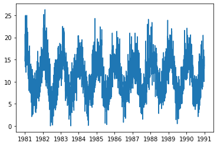

```python

ts['Date'] = pd.to_datetime(ts['Date'])
ts.set_index('Date', inplace=True)
```


```python

# Plot the series
import matplotlib.pyplot as plt

plt.plot(ts)
```

    /Users/johnmaxbarry/anaconda3/lib/python3.7/site-packages/pandas/plotting/_matplotlib/converter.py:103: FutureWarning: Using an implicitly registered datetime converter for a matplotlib plotting method. The converter was registered by pandas on import. Future versions of pandas will require you to explicitly register matplotlib converters.
    
    To register the converters:
    	>>> from pandas.plotting import register_matplotlib_converters
    	>>> register_matplotlib_converters()
      warnings.warn(msg, FutureWarning)


    [<matplotlib.lines.Line2D at 0x119b22e10>]





```python

# What is the shape
ts.shape
```


```python
# How can you upsample the data
ts.resample('')
```
