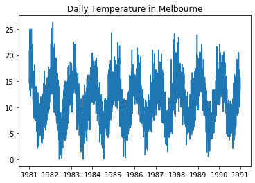

```python

ts['Date'] = pd.to_datetime(ts['Date'])
ts.set_index('Date', inplace=True)
```


```python

# What is the frequency of the time series
print(ts.index)
print('Daily sample from 1981 through 1990')
```

    DatetimeIndex(['1981-01-01', '1981-01-02', '1981-01-03', '1981-01-04',
                   '1981-01-05', '1981-01-06', '1981-01-07', '1981-01-08',
                   '1981-01-09', '1981-01-10',
                   ...
                   '1990-12-22', '1990-12-23', '1990-12-24', '1990-12-25',
                   '1990-12-26', '1990-12-27', '1990-12-28', '1990-12-29',
                   '1990-12-30', '1990-12-31'],
                  dtype='datetime64[ns]', name='Date', length=3650, freq=None)
    Daily sample from 1981 through 1990


```python

# Plot the series
import matplotlib.pyplot as plt

plt.plot(ts)
plt.title('Daily Temperature in Melbourne')
```


    Text(0.5, 1.0, 'Daily Temperature in Melbourne')





What types of patterns do you see in this data?
- Trend?
- Seasonality?
- Change in variance?
- Cyclical?

# __SOLUTION__

What types of patterns do you see in this data?
- Trend - doesn't seem to be
- Seasonality- definitely seems to have yearly seasonality
- Change in variance - Variance looks constant
- Cyclical - does not look cyclical


```python

# What is the shape
ts.shape
```


```python
# How can you upsample the data
ts.resample('')
```
