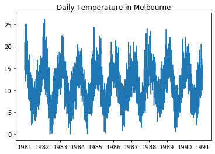

```python
import pandas as pd
import numpy as np
```


```python
# get the dataset
# ! curl https://raw.githubusercontent.com/jbrownlee/Datasets/master/daily-min-temperatures.csv -o 'temps.csv'
```


```python
ts = pd.read_csv('temps.csv')
ts.head()
```


<div>
<style scoped>
    .dataframe tbody tr th:only-of-type {
        vertical-align: middle;
    }

    .dataframe tbody tr th {
        vertical-align: top;
    }

    .dataframe thead th {
        text-align: right;
    }
</style>
<table border="1" class="dataframe">
  <thead>
    <tr style="text-align: right;">
      <th></th>
      <th>Date</th>
      <th>Temp</th>
    </tr>
  </thead>
  <tbody>
    <tr>
      <th>0</th>
      <td>1981-01-01</td>
      <td>20.7</td>
    </tr>
    <tr>
      <th>1</th>
      <td>1981-01-02</td>
      <td>17.9</td>
    </tr>
    <tr>
      <th>2</th>
      <td>1981-01-03</td>
      <td>18.8</td>
    </tr>
    <tr>
      <th>3</th>
      <td>1981-01-04</td>
      <td>14.6</td>
    </tr>
    <tr>
      <th>4</th>
      <td>1981-01-05</td>
      <td>15.8</td>
    </tr>
  </tbody>
</table>
</div>


```python
# What is the first thing we do with a time series dataset

```


```python
# __SOLUTION__

ts['Date'] = pd.to_datetime(ts['Date'])
ts.set_index('Date', inplace=True)
```


```python
# What is the frequency of the time series
```


```python
# __SOLUTION__

# What is the frequency of the time series
print(ts.index)
print('Daily sample from 1981 through 1990')
```

    DatetimeIndex(['1981-01-01', '1981-01-02', '1981-01-03', '1981-01-04',
                   '1981-01-05', '1981-01-06', '1981-01-07', '1981-01-08',
                   '1981-01-09', '1981-01-10',
                   ...
                   '1990-12-22', '1990-12-23', '1990-12-24', '1990-12-25',
                   '1990-12-26', '1990-12-27', '1990-12-28', '1990-12-29',
                   '1990-12-30', '1990-12-31'],
                  dtype='datetime64[ns]', name='Date', length=3650, freq=None)
    Daily sample from 1981 through 1990


```python
# Plot the series
import matplotlib.pyplot as plt

```


```python
# __SOLUTION__

# Plot the series
import matplotlib.pyplot as plt

plt.plot(ts)
plt.title('Daily Temperature in Melbourne')
```


    Text(0.5, 1.0, 'Daily Temperature in Melbourne')





What types of patterns do you see in this data?
- Trend?
- Seasonality?
- Change in variance?
- Cyclical?

# __SOLUTION__

What types of patterns do you see in this data?
- Trend - doesn't seem to be
- Seasonality- definitely seems to have yearly seasonality
- Change in variance - Variance looks constant
- Cyclical - does not look cyclical


```python
# What is the period of the sample?

```


```python
# __SOLUTION__

# What is the shape
ts.shape
```


```python
# How can you upsample the data

```


    Temp    0
    dtype: int64


```python
# __SOLUTION__
# How can you upsample the data
ts.resample('')
```
