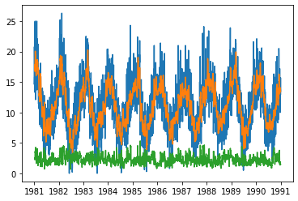
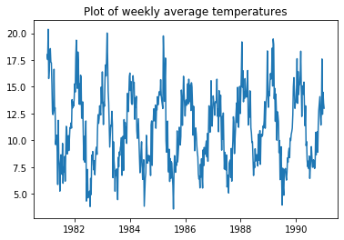
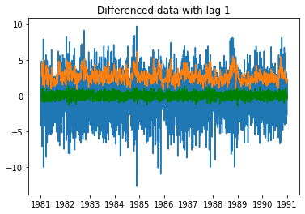
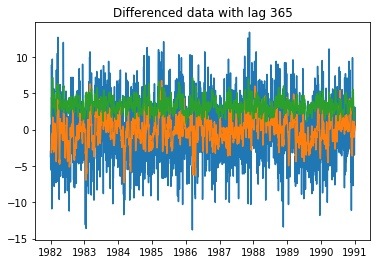
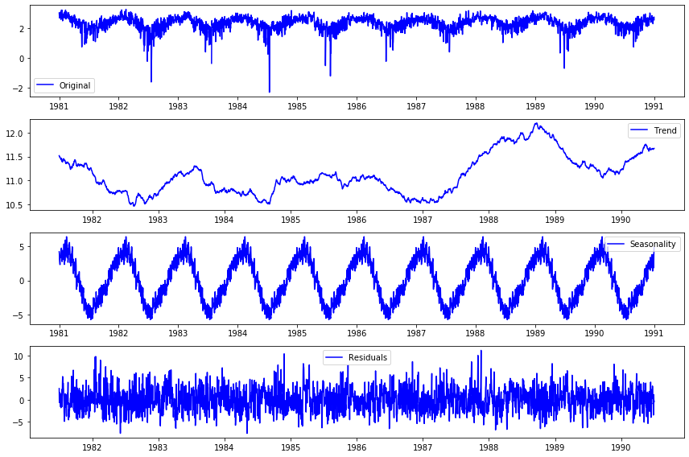
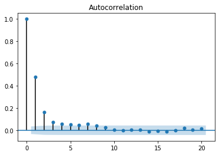
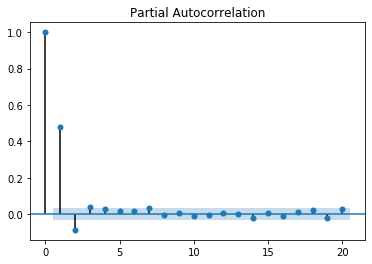

# Time Series Review


```python
import pandas as pd
import numpy as np
```


```python
# get the dataset
# ! curl https://raw.githubusercontent.com/jbrownlee/Datasets/master/daily-min-temperatures.csv -o 'temps.csv'
```


```python
ts = pd.read_csv('temps.csv')
ts.head()
```


<div>
<style scoped>
    .dataframe tbody tr th:only-of-type {
        vertical-align: middle;
    }

    .dataframe tbody tr th {
        vertical-align: top;
    }

    .dataframe thead th {
        text-align: right;
    }
</style>
<table border="1" class="dataframe">
  <thead>
    <tr style="text-align: right;">
      <th></th>
      <th>Date</th>
      <th>Temp</th>
    </tr>
  </thead>
  <tbody>
    <tr>
      <th>0</th>
      <td>1981-01-01</td>
      <td>20.7</td>
    </tr>
    <tr>
      <th>1</th>
      <td>1981-01-02</td>
      <td>17.9</td>
    </tr>
    <tr>
      <th>2</th>
      <td>1981-01-03</td>
      <td>18.8</td>
    </tr>
    <tr>
      <th>3</th>
      <td>1981-01-04</td>
      <td>14.6</td>
    </tr>
    <tr>
      <th>4</th>
      <td>1981-01-05</td>
      <td>15.8</td>
    </tr>
  </tbody>
</table>
</div>


## What is the first thing we do with a time series dataset? 
Change the Date to datetime and assign it as an index


```python
# Your code here
```


```python
# __SOLUTION__

ts['Date'] = pd.to_datetime(ts['Date'])
ts.set_index('Date', inplace=True)
```


```python
# What is the frequency of the time series
```


```python
# __SOLUTION__

# What is the frequency of the time series
print(ts.index)
print('Daily sample from 1981 through 1990')
```

    DatetimeIndex(['1981-01-01', '1981-01-02', '1981-01-03', '1981-01-04',
                   '1981-01-05', '1981-01-06', '1981-01-07', '1981-01-08',
                   '1981-01-09', '1981-01-10',
                   ...
                   '1990-12-22', '1990-12-23', '1990-12-24', '1990-12-25',
                   '1990-12-26', '1990-12-27', '1990-12-28', '1990-12-29',
                   '1990-12-30', '1990-12-31'],
                  dtype='datetime64[ns]', name='Date', length=3650, freq=None)
    Daily sample from 1981 through 1990


```python
# Plot the series
import matplotlib.pyplot as plt

```


```python
# __SOLUTION__

# Plot the series
import matplotlib.pyplot as plt

plt.plot(ts)
plt.title('Daily Temperature in Melbourne')
```


    Text(0.5, 1.0, 'Daily Temperature in Melbourne')


What types of patterns do you see in this data?
- Trend?
- Seasonality?
- Change in variance?
- Cyclical?


```python
# __SOLUTION__

'''
What types of patterns do you see in this data?
- Trend - doesn't seem to be
- Seasonality- definitely seems to have yearly seasonality
- Change in variance - Variance looks constant
- Cyclical - does not look cyclical
'''
```


    "\nWhat types of patterns do you see in this data?\n- Trend - doesn't seem to be\n- Seasonality- definitely seems to have yearly seasonality\n- Change in variance - Variance looks constant\n- Cyclical - does not look cyclical\n"


## Visual Tests for Stationarity

The basic time series models (Autoregressive, Moving Average, ARMA) expect the input time series to be stationary.  We can do some visual checks for stationarity by plotting the rolling mean and std.


```python
# Save the rolling mean and std to the variables defined below

rolling_mean = None
rolling_std = None
```


```python
# __SOLUTION__ 

# Save the rolling mean and std to the variables defined below

# 10 is the window size, which can be larger or smaller depending on the size of your dataset.
rolling_mean = ts.rolling(10).mean()
rolling_std = ts.rolling(10).std()
```


```python
# __SOLUTION__

# Plot the rolling mean and std along with the original time series

plt.plot(ts)
plt.plot(rolling_mean)
plt.plot(rolling_std)
```


    [<matplotlib.lines.Line2D at 0x1c3b6c0b70>]





## Manipulating time series
There are many ways we can manipulate our time series, including resampling and differencing.

## Downsample the data so that it is weekly then plot


```python
# Your code here
```


```python
# __SOLUTION__

# Downsample the data so that it is weekly then plot

ts_weekly = ts.resample('W').mean()

plt.plot(ts_weekly)
plt.title('Plot of weekly average temperatures')

```


    Text(0.5, 1.0, 'Plot of weekly average temperatures')





## Difference the data with different lags. Plot the lagged value along with the rolling mean and std


```python
# your code here
```


```python
# __SOLUTION__
# Difference the data with different lags. Plot the lagged value along with the rolling mean and std

plt.plot(ts.diff(1))
plt.plot(ts.diff(1).rolling(10).mean(), 'green')
plt.plot(ts.diff(1).rolling(10).std())
plt.title('Differenced data with lag 1')
```


    Text(0.5, 1.0, 'Differenced data with lag 1')





```python
# __SOLUTION__
# Difference the data with different lags. Plot the lagged value along with the rolling mean and std

plt.plot(ts.diff(365))
plt.plot(ts.diff(365).rolling(10).mean())
plt.plot(ts.diff(365).rolling(10).std())
plt.title('Differenced data with lag 365')
```


    Text(0.5, 1.0, 'Differenced data with lag 365')





```python
# Run a Dickey Fuller test on the original series and interpret the result.
# Does the Dickey Fuller test make sense with your intuition?
# What is the null hypothesis of the Dickey Fuller test

from statsmodels.tsa.stattools import adfuller

dftest = adfuller()

# Extract and display test results in a user friendly manner
dfoutput = pd.Series(dftest[0:4], index=['Test Statistic', 'p-value', '#Lags Used', 'Number of Observations Used'])
for key,value in dftest[4].items():
    dfoutput['Critical Value (%s)'%key] = value
print(dftest)
```

    (-4.444804924611681, 0.00024708263003611787, 20, 3629, {'1%': -3.4321532327220154, '5%': -2.862336767636517, '10%': -2.56719413172842}, 16642.822304301197)


```python
# __SOLUTION__ 

# Run a Dickey Fuller test on the original series and interpret the result.
# Does the Dickey Fuller test make sense with your intuition?
from statsmodels.tsa.stattools import adfuller

dftest = adfuller(ts['Temp'])

# Extract and display test results in a user friendly manner
dfoutput = pd.Series(dftest[0:4], index=['Test Statistic', 'p-value', '#Lags Used', 'Number of Observations Used'])
for key,value in dftest[4].items():
    dfoutput['Critical Value (%s)'%key] = value
print(dftest)

# No, it doesn't really.  The Dickey Fuller Test says sationary, but there is seasonal stationarity.
# DF does not take into account seasonal fluctuations.
```

    (-4.444804924611681, 0.00024708263003611787, 20, 3629, {'1%': -3.4321532327220154, '5%': -2.862336767636517, '10%': -2.56719413172842}, 16642.822304301197)


```python
# __SOLUTION__

# Plot decompostion

# Import and apply seasonal_decompose()
from statsmodels.tsa.seasonal import seasonal_decompose
decomposition = seasonal_decompose(ts, freq=365)

# Gather the trend, seasonality, and residuals 
trend = decomposition.trend
seasonal = decomposition.seasonal
residual = decomposition.resid

# Plot gathered statistics
plt.figure(figsize=(12,8))
plt.subplot(411)
plt.plot(np.log(ts), label='Original', color='blue')
plt.legend(loc='best')
plt.subplot(412)
plt.plot(trend, label='Trend', color='blue')
plt.legend(loc='best')
plt.subplot(413)
plt.plot(seasonal,label='Seasonality', color='blue')
plt.legend(loc='best')
plt.subplot(414)
plt.plot(residual, label='Residuals', color='blue')
plt.legend(loc='best')
plt.tight_layout()
```

    /Users/johnmaxbarry/.local/lib/python3.7/site-packages/ipykernel_launcher.py:17: RuntimeWarning: divide by zero encountered in log





##  Basic Time Series Models

## Autoregressive Model
$$\large Y_t = \mu + \phi * Y_{t-1}+\epsilon_t$$

- 1st order: Predict today's value based on yesterday's value

## Moving Average Model

$$\large Y_t = \mu +\epsilon_t + \theta * \epsilon_{t-1}$$

- 1st order: Predict today's value based on the weighted sum of today and yesterday's error


To determine the order, we look at partial autocorrelation and autocorrelation plots.

Use statsmodels to plot the pacf and acf of the residuals. We use residuals because the basic ARMA and MA models expect stationary series as inputs.

What do the plots suggest are the correct terms for MA and AR?


```python
# Your code here
from statsmodels.graphics.tsaplots import plot_pacf, plot_acf
```


```python
# __SOLUTION__
from statsmodels.graphics.tsaplots import plot_pacf, plot_acf

plot_acf(residual.dropna(), lags=20)
plot_pacf(residual.dropna(), lags=20)
```








# NLP Review 


```python
# Import nltk, our favorite Natural Language Processing library
import nltk

# Look at the Project Gutenberg texts in NLTK
nltk.corpus.gutenberg.fileids()
```


    ['austen-emma.txt',
     'austen-persuasion.txt',
     'austen-sense.txt',
     'bible-kjv.txt',
     'blake-poems.txt',
     'bryant-stories.txt',
     'burgess-busterbrown.txt',
     'carroll-alice.txt',
     'chesterton-ball.txt',
     'chesterton-brown.txt',
     'chesterton-thursday.txt',
     'edgeworth-parents.txt',
     'melville-moby_dick.txt',
     'milton-paradise.txt',
     'shakespeare-caesar.txt',
     'shakespeare-hamlet.txt',
     'shakespeare-macbeth.txt',
     'whitman-leaves.txt']


```python
# Let's look at the Jane Austin novels

austen_file_ids = nltk.corpus.gutenberg.fileids()[:3]

austen_docs = [nltk.corpus.gutenberg.raw(file_id)[:5000] for file_id in austen_file_ids]
austen_docs[0]
```


    "[Emma by Jane Austen 1816]\n\nVOLUME I\n\nCHAPTER I\n\n\nEmma Woodhouse, handsome, clever, and rich, with a comfortable home\nand happy disposition, seemed to unite some of the best blessings\nof existence; and had lived nearly twenty-one years in the world\nwith very little to distress or vex her.\n\nShe was the youngest of the two daughters of a most affectionate,\nindulgent father; and had, in consequence of her sister's marriage,\nbeen mistress of his house from a very early period.  Her mother\nhad died too long ago for her to have more than an indistinct\nremembrance of her caresses; and her place had been supplied\nby an excellent woman as governess, who had fallen little short\nof a mother in affection.\n\nSixteen years had Miss Taylor been in Mr. Woodhouse's family,\nless as a governess than a friend, very fond of both daughters,\nbut particularly of Emma.  Between _them_ it was more the intimacy\nof sisters.  Even before Miss Taylor had ceased to hold the nominal\noffice of governess, the mildness of her temper had hardly allowed\nher to impose any restraint; and the shadow of authority being\nnow long passed away, they had been living together as friend and\nfriend very mutually attached, and Emma doing just what she liked;\nhighly esteeming Miss Taylor's judgment, but directed chiefly by\nher own.\n\nThe real evils, indeed, of Emma's situation were the power of having\nrather too much her own way, and a disposition to think a little\ntoo well of herself; these were the disadvantages which threatened\nalloy to her many enjoyments.  The danger, however, was at present\nso unperceived, that they did not by any means rank as misfortunes\nwith her.\n\nSorrow came--a gentle sorrow--but not at all in the shape of any\ndisagreeable consciousness.--Miss Taylor married.  It was Miss\nTaylor's loss which first brought grief.  It was on the wedding-day\nof this beloved friend that Emma first sat in mournful thought\nof any continuance.  The wedding over, and the bride-people gone,\nher father and herself were left to dine together, with no prospect\nof a third to cheer a long evening.  Her father composed himself\nto sleep after dinner, as usual, and she had then only to sit\nand think of what she had lost.\n\nThe event had every promise of happiness for her friend.  Mr. Weston\nwas a man of unexceptionable character, easy fortune, suitable age,\nand pleasant manners; and there was some satisfaction in considering\nwith what self-denying, generous friendship she had always wished\nand promoted the match; but it was a black morning's work for her.\nThe want of Miss Taylor would be felt every hour of every day.\nShe recalled her past kindness--the kindness, the affection of sixteen\nyears--how she had taught and how she had played with her from five\nyears old--how she had devoted all her powers to attach and amuse\nher in health--and how nursed her through the various illnesses\nof childhood.  A large debt of gratitude was owing here; but the\nintercourse of the last seven years, the equal footing and perfect\nunreserve which had soon followed Isabella's marriage, on their\nbeing left to each other, was yet a dearer, tenderer recollection.\nShe had been a friend and companion such as few possessed: intelligent,\nwell-informed, useful, gentle, knowing all the ways of the family,\ninterested in all its concerns, and peculiarly interested in herself,\nin every pleasure, every scheme of hers--one to whom she could speak\nevery thought as it arose, and who had such an affection for her\nas could never find fault.\n\nHow was she to bear the change?--It was true that her friend was\ngoing only half a mile from them; but Emma was aware that great must\nbe the difference between a Mrs. Weston, only half a mile from them,\nand a Miss Taylor in the house; and with all her advantages,\nnatural and domestic, she was now in great danger of suffering\nfrom intellectual solitude.  She dearly loved her father, but he\nwas no companion for her.  He could not meet her in conversation,\nrational or playful.\n\nThe evil of the actual disparity in their ages (and Mr. Woodhouse had\nnot married early) was much increased by his constitution and habits;\nfor having been a valetudinarian all his life, without activity\nof mind or body, he was a much older man in ways than in years;\nand though everywhere beloved for the friendliness of his heart\nand his amiable temper, his talents could not have recommended him\nat any time.\n\nHer sister, though comparatively but little removed by matrimony,\nbeing settled in London, only sixteen miles off, was much beyond\nher daily reach; and many a long October and November evening must\nbe struggled through at Hartfield, before Christmas brought the next\nvisit from Isabella and her husband, and their little children,\nto fill the house, and give her pleasant society again.\n\nHighbury, the large and populous village, almost amounting to a town,\nto which Hartfield, in spite of its separate lawn, and shrubberies,\nand name, did really belong, afforded her no equals.  The Woodhouses\nwere "


## What are the preprocessing steps 


```python
# Your answer here
```


```python
# __SOLUTION__
# What are the preprocessing steps 
'''
1. Remove punctuation/numbers
2. make lower case
3. Remove stopwords
4. STEM/Lemmatize
'''

```


    '\n1. Remove punctuation/numbers\n2. make lower case\n3. Remove stopwords\n4. STEM/Lemmatize\n'


## Let's perform manual removal with list comprehensions and such


```python
# your code here
```


```python
# __SOLUTION__ 

# Manual removal with list comprehension

emma_tokens = austen_docs[0].split(' ')
emma_tokens_no_n = []
for token in emma_tokens:
    if '\n' in token:
        no_n = token.split('\n')
        no_n = [word for word in no_n if word != '']
        [emma_tokens_no_n.append(word) for word in no_n]
    else:
        emma_tokens_no_n.append(token)
        
# Manual Removal of punct
import string
# emma_tokens_no_n = [word for word in emma_tokens_no_n if word not in string.punctuation]
emma_tokens_lower = [word.lower() for word in emma_tokens_no_n]
emma_no_punct = [word.translate(str.maketrans('', '', string.punctuation)) 
                 for word in emma_tokens_lower]


# Remove stopwords
from nltk.corpus import stopwords

stopwords = stopwords.words('english')
emma_no_stop = [word for word in emma_no_punct if word not in stopwords]

```

## We can also use sklearn's built in tools.
First code a Count Vectorizer, and change some of the parameters to do different things


```python
# your code here
```


```python
# __SOLUTION__

# We can also use sklearn's built in tools.
# First code a Count Vectorizer, and change some of the parameters to do different things

# Use cv/tfidf
from sklearn.feature_extraction.text import CountVectorizer, TfidfVectorizer

cv = CountVectorizer(token_pattern='[a-zA-Z][a-z]*', min_df =2, ngram_range=(1,2), stop_words=stopwords)

doc_term = pd.DataFrame(cv.fit_transform(austen_docs).toarray())
doc_term.columns = cv.vocabulary_
doc_term.head()
```


<div>
<style scoped>
    .dataframe tbody tr th:only-of-type {
        vertical-align: middle;
    }

    .dataframe tbody tr th {
        vertical-align: top;
    }

    .dataframe thead th {
        text-align: right;
    }
</style>
<table border="1" class="dataframe">
  <thead>
    <tr style="text-align: right;">
      <th></th>
      <th>jane</th>
      <th>austen</th>
      <th>volume</th>
      <th>chapter</th>
      <th>handsome</th>
      <th>comfortable</th>
      <th>home</th>
      <th>best</th>
      <th>existence</th>
      <th>lived</th>
      <th>...</th>
      <th>steady</th>
      <th>provided</th>
      <th>known</th>
      <th>like</th>
      <th>remaining</th>
      <th>single</th>
      <th>dear</th>
      <th>sake</th>
      <th>austen chapter</th>
      <th>three girls</th>
    </tr>
  </thead>
  <tbody>
    <tr>
      <th>0</th>
      <td>0</td>
      <td>3</td>
      <td>0</td>
      <td>1</td>
      <td>1</td>
      <td>1</td>
      <td>1</td>
      <td>1</td>
      <td>0</td>
      <td>1</td>
      <td>...</td>
      <td>2</td>
      <td>0</td>
      <td>0</td>
      <td>1</td>
      <td>1</td>
      <td>1</td>
      <td>1</td>
      <td>6</td>
      <td>1</td>
      <td>1</td>
    </tr>
    <tr>
      <th>1</th>
      <td>1</td>
      <td>0</td>
      <td>1</td>
      <td>1</td>
      <td>1</td>
      <td>1</td>
      <td>1</td>
      <td>1</td>
      <td>2</td>
      <td>1</td>
      <td>...</td>
      <td>1</td>
      <td>1</td>
      <td>2</td>
      <td>0</td>
      <td>3</td>
      <td>1</td>
      <td>1</td>
      <td>2</td>
      <td>0</td>
      <td>1</td>
    </tr>
    <tr>
      <th>2</th>
      <td>1</td>
      <td>1</td>
      <td>1</td>
      <td>3</td>
      <td>2</td>
      <td>0</td>
      <td>2</td>
      <td>0</td>
      <td>1</td>
      <td>1</td>
      <td>...</td>
      <td>1</td>
      <td>1</td>
      <td>3</td>
      <td>1</td>
      <td>1</td>
      <td>0</td>
      <td>0</td>
      <td>6</td>
      <td>2</td>
      <td>0</td>
    </tr>
  </tbody>
</table>
<p>3 rows × 149 columns</p>
</div>


 ## What is the cosine similarity of the texts based on CV


```python
# __SOLUTION__
# What is the cosine similarity of the texts based on CV
from sklearn.metrics.pairwise import cosine_similarity

cosine_similarity(doc_term)
```


    array([[1.        , 0.46193872, 0.53285797],
           [0.46193872, 1.        , 0.48051758],
           [0.53285797, 0.48051758, 1.        ]])


## Perform same transformation with TFIDF


```python
# your code here
```


```python
# __SOLUTION__
# Perform same transformation with TFIDF

# TFIDF 
from sklearn.feature_extraction.text import CountVectorizer, TfidfVectorizer

tfidf = TfidfVectorizer(token_pattern='[a-zA-Z][a-z]*', min_df =2, ngram_range=(1,2), stop_words=stopwords)

doc_term = pd.DataFrame(tfidf.fit_transform(austen_docs).toarray())
doc_term.columns = tfidf.vocabulary_
doc_term.head()

```


<div>
<style scoped>
    .dataframe tbody tr th:only-of-type {
        vertical-align: middle;
    }

    .dataframe tbody tr th {
        vertical-align: top;
    }

    .dataframe thead th {
        text-align: right;
    }
</style>
<table border="1" class="dataframe">
  <thead>
    <tr style="text-align: right;">
      <th></th>
      <th>jane</th>
      <th>austen</th>
      <th>volume</th>
      <th>chapter</th>
      <th>handsome</th>
      <th>comfortable</th>
      <th>home</th>
      <th>best</th>
      <th>existence</th>
      <th>lived</th>
      <th>...</th>
      <th>steady</th>
      <th>provided</th>
      <th>known</th>
      <th>like</th>
      <th>remaining</th>
      <th>single</th>
      <th>dear</th>
      <th>sake</th>
      <th>austen chapter</th>
      <th>three girls</th>
    </tr>
  </thead>
  <tbody>
    <tr>
      <th>0</th>
      <td>0.000000</td>
      <td>0.166475</td>
      <td>0.000000</td>
      <td>0.043094</td>
      <td>0.043094</td>
      <td>0.055492</td>
      <td>0.043094</td>
      <td>0.055492</td>
      <td>0.000000</td>
      <td>0.043094</td>
      <td>...</td>
      <td>0.086188</td>
      <td>0.000000</td>
      <td>0.000000</td>
      <td>0.055492</td>
      <td>0.043094</td>
      <td>0.055492</td>
      <td>0.055492</td>
      <td>0.258565</td>
      <td>0.055492</td>
      <td>0.055492</td>
    </tr>
    <tr>
      <th>1</th>
      <td>0.063581</td>
      <td>0.000000</td>
      <td>0.063581</td>
      <td>0.049376</td>
      <td>0.049376</td>
      <td>0.063581</td>
      <td>0.049376</td>
      <td>0.063581</td>
      <td>0.127162</td>
      <td>0.049376</td>
      <td>...</td>
      <td>0.049376</td>
      <td>0.063581</td>
      <td>0.127162</td>
      <td>0.000000</td>
      <td>0.148128</td>
      <td>0.063581</td>
      <td>0.063581</td>
      <td>0.098752</td>
      <td>0.000000</td>
      <td>0.063581</td>
    </tr>
    <tr>
      <th>2</th>
      <td>0.046954</td>
      <td>0.046954</td>
      <td>0.046954</td>
      <td>0.109391</td>
      <td>0.072927</td>
      <td>0.000000</td>
      <td>0.072927</td>
      <td>0.000000</td>
      <td>0.046954</td>
      <td>0.036464</td>
      <td>...</td>
      <td>0.036464</td>
      <td>0.046954</td>
      <td>0.140861</td>
      <td>0.046954</td>
      <td>0.036464</td>
      <td>0.000000</td>
      <td>0.000000</td>
      <td>0.218782</td>
      <td>0.093907</td>
      <td>0.000000</td>
    </tr>
  </tbody>
</table>
<p>3 rows × 149 columns</p>
</div>


## look at similarity with tfidf


```python
# your code here
```


```python
# __SOLUTION__

# look at similarity with tfidf

from sklearn.metrics.pairwise import cosine_similarity

cosine_similarity(doc_term)
```


    array([[1.        , 0.46193872, 0.53285797],
           [0.46193872, 1.        , 0.48051758],
           [0.53285797, 0.48051758, 1.        ]])


